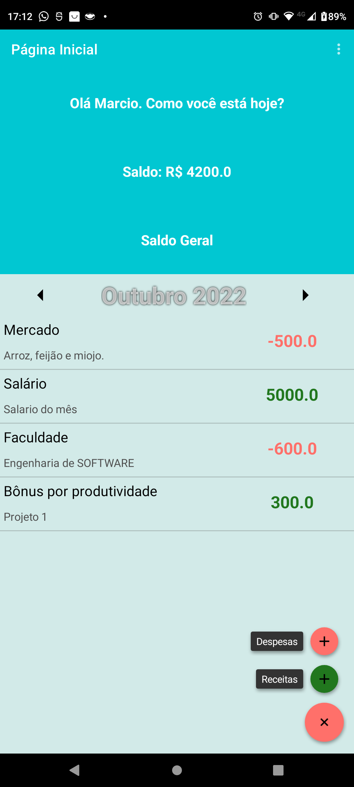

# Clonne Organizze
### App não funcional criado com propósitos educacionais simplismente para treinar conhecimento
#### Iniciado 21/09/2022
#### Finalizado 19/10/2022

# Sliders Iniciais

# Splash Page

# Login

# Cadastro

# Página Inicial

# Despesas

# Receitas

# Demostração

<html>

<iframe width="560" height="315" src="https://www.youtube.com/embed/C9Etwq9hl9o" title="YouTube video player" frameborder="0" allow="accelerometer; autoplay; clipboard-write; encrypted-media; gyroscope; picture-in-picture" allowfullscreen />
</html>

